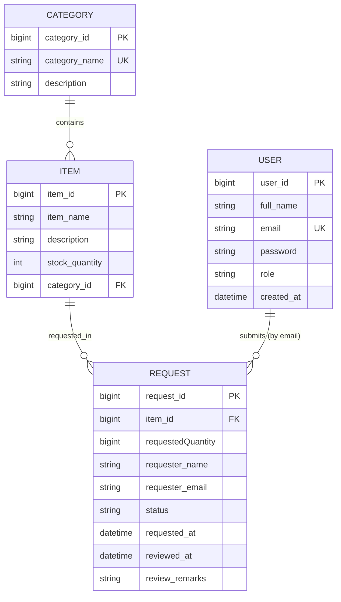

# Inventory Management System

A comprehensive REST API for managing inventory with categories, items, and user requests, built with Spring Boot, PostgreSQL, and a modern web interface.

## 🚀 Technologies Used

- **Backend:**
  - Java 23
  - Spring Boot 3.5.11
  - Spring Data JPA
  - Spring Security (JWT Authentication)
  - Lombok
  - Maven

- **Database:**
  - PostgreSQL 18.3
  - Docker & Docker Compose

- **Frontend:**
  - HTML5, CSS3, JavaScript (ES6+)
  - Bootstrap 5
  - Thymeleaf (template rendering)
  - JWT Token-based Authentication

## 📋 Features

### Core Modules

#### Category Management
- Create, read, update, and delete categories
- Prevent deletion of categories with associated items
- Unique category names validation
- Category-based item organization

#### Item Management
- Complete CRUD operations for inventory items
- Stock quantity tracking and real-time updates
- Item search by name and category filtering
- Low stock monitoring and alerts
- Inventory statistics and analytics
- Category association

#### Request Management
- **Direct Request-Item Relationship:**
  - Each request currently references one item
  - Request stores requester name and email directly
  - Status lifecycle: PENDING -> APPROVED/REJECTED
- **Request Workflow:**
  - **Users** can submit new item requests
  - **Admins** can review and approve/reject requests
  - Stock validation before approval
  - Automatic stock reduction on request approval
  - Request status tracking (PENDING, APPROVED, REJECTED)
- **Request History:**
  - View submitted requests (My Requests)
  - Admin request management interface
  - Request details with requester information
  - Approval remarks and timestamps

#### User Authentication
- JWT-based authentication system
- Session management via HTTP-only cookies
- User identification (name and email)
- Login/Logout functionality
- Protected endpoints with authentication checks

### Dashboard Features
- **Real-time Statistics:**
  - Total items in inventory
  - Total categories
  - Low stock items count
  - Pending requests overview
  - Approved requests summary
- **Interactive Widgets:**
  - Pending requests with item details
  - Approved requests list
  - Quick access to request actions

## 🛠️ Setup & Installation

### Prerequisites

- Java 23 or higher
- Docker Desktop
- Maven (included via wrapper)
- Modern web browser

### 1. Start PostgreSQL Database

```powershell
docker compose up -d
```

### 2. Run the Application

```powershell
.\mvnw.cmd spring-boot:run
```

The application will start on `http://localhost:8081`

### 3. Access the Web Interface

Open your browser and navigate to:
```
http://localhost:8081/
```

## 📡 API Endpoints

### Authentication Endpoints

| Method | Endpoint        | Description           | Body                          |
| ------ | --------------- | --------------------- | ----------------------------- |
| POST   | `/auth/login`   | User login            | `{username, password}`        |
| POST   | `/auth/logout`  | User logout           | —                             |
| GET    | `/auth/profile` | Get logged-in user    | —                             |

### Category Endpoints

| Method | Endpoint               | Description         | Auth Required |
| ------ | ---------------------- | ------------------- | ------------- |
| POST   | `/api/categories`      | Create new category | Yes           |
| GET    | `/api/categories`      | Get all categories  | No            |
| GET    | `/api/categories/{id}` | Get category by ID  | No            |
| PUT    | `/api/categories/{id}` | Update category     | Yes           |
| DELETE | `/api/categories/{id}` | Delete category     | Yes           |

### Item Endpoints

| Method | Endpoint                             | Description              | Auth Required |
| ------ | ------------------------------------ | ------------------------ | ------------- |
| POST   | `/api/items`                         | Create new item          | Yes           |
| GET    | `/api/items`                         | Get all items            | No            |
| GET    | `/api/items/{id}`                    | Get item by ID           | No            |
| GET    | `/api/items/category/{categoryId}`   | Get items by category    | No            |
| GET    | `/api/items/search?name={name}`      | Search items by name     | No            |
| GET    | `/api/items/low-stock?threshold={n}` | Get low stock items      | No            |
| GET    | `/api/items/stats`                   | Get inventory statistics | No            |
| PUT    | `/api/items/{id}`                    | Update item              | Yes           |
| PUT    | `/api/items/{id}/stock`              | Update stock quantity    | Yes           |
| DELETE | `/api/items/{id}`                    | Delete item              | Yes           |

### Request Endpoints

| Method | Endpoint                   | Description                    | Auth Required | Body                                           |
| ------ | -------------------------- | ------------------------------ | ------------- | ---------------------------------------------- |
| POST   | `/api/requests`            | Submit new request             | No            | `{itemId, requestedQuantity, requesterName, requesterEmail}` |
| GET    | `/api/requests`            | Get all requests               | No            |                                                |
| GET    | `/api/requests/{id}`       | Get request by ID              | No            |                                                |
| GET    | `/api/requests/item/{id}`  | Get requests for an item       | No            |                                                |
| PUT    | `/api/requests/{id}/review`| Review/approve/reject request  | Yes           | `{approved, reviewRemarks}`                    |

## 📝 Request Submission Examples

### Submit Request

```powershell
$body = @{
  itemId = 1
  requestedQuantity = 5
    requesterName = "John Doe"
    requesterEmail = "john@example.com"
} | ConvertTo-Json

Invoke-RestMethod -Uri "http://localhost:8081/api/requests" -Method POST -ContentType "application/json" -Body $body
```

### Submit Another Request (Different Item)

```powershell
$body = @{
  itemId = 3
  requestedQuantity = 10
    requesterName = "Jane Smith"
    requesterEmail = "jane@example.com"
} | ConvertTo-Json

Invoke-RestMethod -Uri "http://localhost:8081/api/requests" -Method POST -ContentType "application/json" -Body $body
```

### Review Request (Admin Only)

```powershell
$body = @{
    approved = $true
    reviewRemarks = "Request approved. Stock available."
} | ConvertTo-Json

Invoke-RestMethod -Uri "http://localhost:8081/api/requests/1/review" -Method PUT -ContentType "application/json" -Body $body -Headers @{Authorization = "Bearer <token>"}
```

## 🌐 Web Interface Pages

| Page              | URL              | Description                          |
| ----------------- | ---------------- | ------------------------------------ |
| Dashboard         | `/`              | Overview and quick stats             |
| Submit Request    | `/request-form`  | Create new single-item request        |
| My Requests       | `/my-requests`   | View user's submitted requests       |
| Manage Requests   | `/manage-requests` | Admin panel for request approval   |

## 📊 Frontend Features

### Request Submission Form
- Select item from dropdown
- Enter quantity
- Automatic form validation
- Real-time error messages
- XSS attack prevention with HTML escaping

### My Requests Page
- View all submitted requests
- Display items breakdown per request
- Request status indicators (PENDING/APPROVED/REJECTED)
- Filter and sort capabilities
- Requester information display

### Admin Manage Requests
- Approve/reject pending requests
- View all request items at a glance
- Add approval remarks
- Status update with timestamps
- Request history

### Dashboard
- Real-time inventory statistics
- Pending requests widget (with item details)
- Approved requests widget
- Quick navigation to main functions
- Visual status indicators

## 📝 Common API Usage Examples

### Create Category

```powershell
$body = @{
    categoryName = "Electronics"
    description = "Electronic items"
} | ConvertTo-Json

Invoke-RestMethod -Uri "http://localhost:8081/api/categories" -Method POST -ContentType "application/json" -Body $body
```

### Create Item

```powershell
$body = @{
    itemName = "Laptop"
    description = "Dell Laptop"
    stockQuantity = 50
    categoryId = 1
} | ConvertTo-Json

Invoke-RestMethod -Uri "http://localhost:8081/api/items" -Method POST -ContentType "application/json" -Body $body
```

### Get All Items

```powershell
Invoke-RestMethod -Uri "http://localhost:8081/api/items" -Method GET
```

### Search Items

```powershell
Invoke-RestMethod -Uri "http://localhost:8081/api/items/search?name=Laptop" -Method GET
```

### Get Low Stock Items

```powershell
Invoke-RestMethod -Uri "http://localhost:8081/api/items/low-stock?threshold=10" -Method GET
```

### Update Stock

```powershell
$body = @{
    stockQuantity = 75
} | ConvertTo-Json

Invoke-RestMethod -Uri "http://localhost:8081/api/items/1/stock" -Method PUT -ContentType "application/json" -Body $body
```

## 🗄️ Database Configuration

**PostgreSQL Details:**

- Host: `localhost`
- Port: `5433` (mapped from container port 5432)
- Database: `mydatabase`
- Username: `myuser`
- Password: `secret`

**Connection String:**

```
jdbc:postgresql://127.0.0.1:5433/mydatabase
```

## 🏗️ Project Structure

```
src/main/java/com/inventory/inventory_management/
├── controller/          # REST API endpoints
├── service/            # Business logic layer
├── repository/         # Data access layer
├── entity/             # JPA entities
├── dto/                # Data transfer objects
├── exception/          # Exception handling
└── config/             # Application configuration

src/main/resources/
├── static/            # Frontend assets
│   ├── css/           # Bootstrap & custom styles
│   ├── js/
│   │   ├── api/       # API client utilities
│   │   └── pages/     # Page-specific scripts
│   └── images/        # Static images
└── templates/         # Thymeleaf templates
```

## ER Diagram



Note: USER entity is stored in the `app_users` table. The USER-to-REQUEST link is logical via `requester_email` (no direct foreign key is currently implemented).

## 🔒 Security

### Current Implementation
- JWT-based authentication system
- HTTP-only cookie storage for tokens
- Password validation
- User session management
- Protected API endpoints (where applicable)

### Features
- **Authentication:** Login/logout with JWT tokens
- **Session:** Automatic token refresh
- **CORS:** Configured for local development
- **XSS Protection:** HTML escaping on frontend

### Future Enhancement
- Role-based access control (ADMIN, MANAGER, USER)
- Fine-grained request approval permissions
- Audit logging for sensitive operations

## 🧪 Testing

### Run Tests

```powershell
.\mvnw.cmd test
```

### Access Database

```powershell
docker exec -it inventory_management-postgres-1 psql -U myuser -d mydatabase
```

### View Tables

```sql
\dt
SELECT * FROM categories;
SELECT * FROM items;
SELECT * FROM requests;
```

### Database Schema Notes

**Request Table:**
- **requests:** Stores request metadata (item reference, requester info, status, timestamps)
- Current requester linkage uses `requester_email` text data; no direct `user_id` foreign key is defined yet.

## 📦 Docker Commands

**Start Database:**

```powershell
docker compose up -d
```

**Stop Database:**

```powershell
docker compose down
```

**View Logs:**

```powershell
docker logs inventory_management-postgres-1
```

**Check Running Containers:**

```powershell
docker ps
```

## 🚀 Key Features Summary

✅ **Request Management System**
- Submit and track item requests
- Admin review and decision workflow
- Stock validation before approval

✅ **Real-time Inventory Management**
- Automatic stock updates on request approval
- Low stock alerts and monitoring
- Category-based organization

✅ **User-Friendly Web Interface**
- Dashboard with key metrics
- Request submission and tracking
- Admin approval workflow

✅ **Secure Authentication**
- JWT-based login system
- Session management
- Protected operations

✅ **RESTful API**
- Comprehensive endpoints for all operations
- JSON request/response format
- Clear error handling

## 👥 Team

**SEPM Project - Inventory Management System**

- Category & Item Management
- Request Management and approval workflow
- REST API Development
- Full-Stack Web Application
- Database Integration

## 📄 License

This project is developed as part of the SEPM course.

---

**Last Updated:** April 6, 2026
**Current Branch:** finishing
**Status:** Request and user linkage documentation aligned ✅
